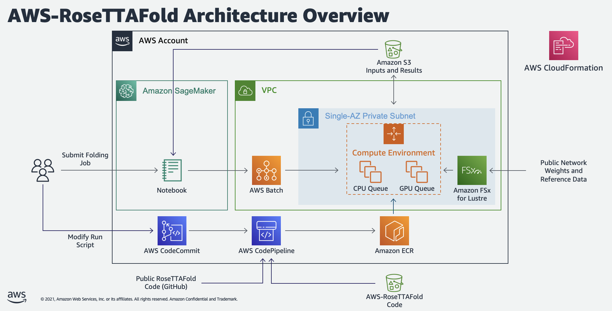
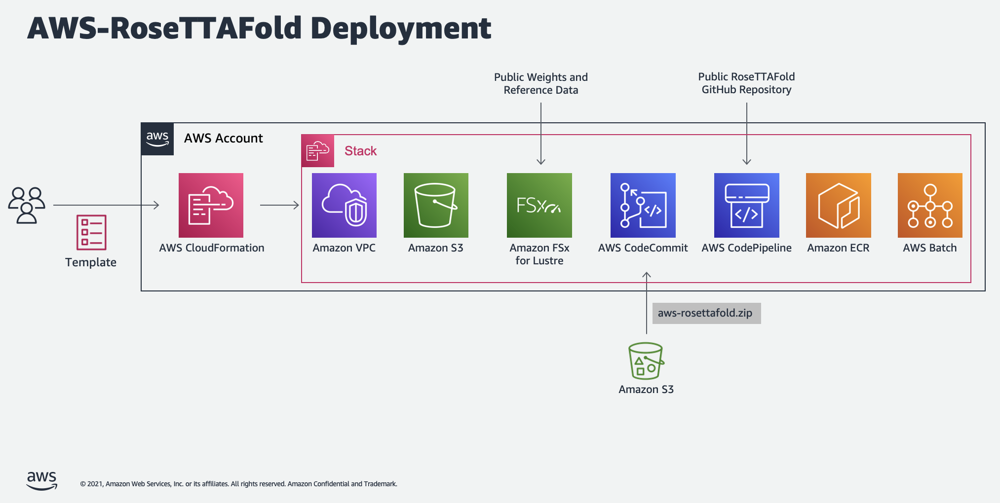

# AWS RoseTTAFold
Infrastructure template and Jupyter notebooks for running RoseTTAFold on AWS Batch. 

## Overview
Proteins are large biomolecules that play an important role in the body. Knowing the physical structure of proteins is key to understanding their function. However, it can be difficult and expensive to determine the structure of many proteins experimentally. One alternative is to predict these structures using machine learning algorithms. Several high-profile research teams have released such algorithms, including AlphaFold 2 (from [DeepMind](https://deepmind.com/blog/article/alphafold-a-solution-to-a-50-year-old-grand-challenge-in-biology)) and RoseTTAFold (From the [Baker lab at the University of Washington](https://www.ipd.uw.edu/2021/07/rosettafold-accurate-protein-structure-prediction-accessible-to-all/)). 

Both AlphaFold 2 and RoseTTAFold use a multi-track transformer architecture trained on known protein templates to predict the structure of unknown peptide sequences. These predictions are heavily GPU-dependent and take anywhere from minutes to days to complete. The input features for these predictions include multiple sequence alignment (MSA) data. MSA algorithms are CPU-dependent and can themselves require several hours of processing time. 

Running both the MSA and structure prediction steps in the same computing environment can be cost inefficient, because the expensive GPU resources required for the prediction sit unused while the MSA step runs. Instead, using a high performance computing (HPC) service like [AWS Batch](https://aws.amazon.com/batch/) allows us to run each step as a containerized job with the best fit of CPU, memory, and GPU resources.

This project demonstrates how to provision and use AWS services for running the RoseTTAFold protein folding algorithm on AWS Batch. 

## Quick Start
1. (AWS internal testing only) Send Brian Loyal (bloyal) the account id and region you want to use for testing so he can add it to the ref data bucket policy. This will not be necessary once we have OSS approval.
2. Log into the AWS Console and select one of the following supported regions:
  - us-east-1
  - us-west-2
3. Navigate to the CloudFormation service and create a new stack using the `config/cfn.yaml` template in this repository.
4. It will take 17 minutes for CloudFormation to create the stack and another 5 minutes for CodeBuild to build and publish the container. Please wait for both of these tasks to finish before you submit any analysis jobs. 
5. Clone the CodeCommit repository created by CloudFormation to a Jupyter Notebook environment of your choice.
6. Use the `AWS-RoseTTAFold.ipynb` and `CASP14-Analysis.ipynb` notebooks to submit protein sequences for analysis. Note that the first job you submit will cause the FSx file system to transfer and compress 3 TB of reference data from S3. This process will require 3-4 hours to complete. The duration of subsequent jobs will depend on the length and complexity of the protein sequence.

## Architecture

This project creates two computing environments in AWS Batch to run the "end-to-end" protein folding workflow in RoseTTAFold. The first of these uses the optimal mix of `c4`, `m4`, and `r4` spot instance types based on the vCPU and memory requirements specified in the Batch job. The second environment uses `g4dn` on-demand instances to balance performance, availability, and cost.

A scientist can create structure prediction jobs using one of the two included Jupyter notebooks. `AWS-RoseTTAFold.ipynb` demonstrates how to submit a single analysis job and view the results. `CASP14-Analysis.ipynb` demonstrates how to submit multiple jobs at once using the CASP14 target list. In both of these cases, submitting a sequence for analysis creates two Batch jobs, one for data preparation (using the CPU computing environment) and a second, dependent job for structure prediction (using the GPU computing environment). 

During execution, both the data preparation and structure prediction jobs require access to several public reference data sets, including `Uniref30`, `BFD`, and `pdb100`. For convinience, we've provided this data in public S3 buckets, which are automatically replicated to FSx Lustre file systems when the first job executes. These buckets are currently available in the `us-east-1` and `us-west-2` regions only. NOTE TO AMAZONIANS: these buckets aren't actually public yet, they're open to the CORP Cidr blocks. This will change once OSS approval is in place.

Both the data preparation and structure prediction use the same Docker image for execution. This image, based on the public Nvidia CUDA image for Ubuntu 20, includes the v1.1 release of the public [RoseTTAFold repository](https://github.com/RosettaCommons/RoseTTAFold), as well as additional scripts for integrating with AWS services. CodeBuild will automatically download this container definition and build the required image during stack creation. However, end users can make changes to this image by pushing to the CodeCommit repository included in the stack .

## Costs
This workload costs approximately $270 per month to maintain, plus another $2.56 per job.

## Deployment

Running the CloudFormation template at `config/cfn.yaml` creates the following resources in the specified availability zone:
1. A new VPC with a private subnet, public subnet, NAT gateway, internet gateway, elastic IP, route tables, and S3 gateway endpoint.
2. A FSx Lustre file system with 1.2 TiB of storage and 120 MB/s throughput capacity. This file system is linked to the reference data S3 bucket for the region of interest (us-east-1 or us-west-2) for loading the required reference data when the first job executes.
3. An EC2 launch template for mounting the FSX file system to Batch compute instances.
4. A set of AWS Batch compute environments, job queues, and job definitions for running the CPU-dependent data prep job and a second for the GPU-dependent prediction job.
5. CodeCommit, CodeBuild, CodePipeline, and ECR resources for building and publishing the Batch container image. When CloudFormation creates the CodeCommit repository, it populates it with the code stored in the reference data S3 bucket. This is the same bucket used as the data repository for FSx. CodeBuild uses this repository as its source and adds additional code from release 1.1 of the public [RoseTTAFold repository](https://github.com/RosettaCommons/RoseTTAFold). CodeBuild then publishes the resulting container image to ECR, where Batch jobs can use it as needed.

## Licensing
The University of Washington has made the code and data in the [RoseTTAFold public repository](https://github.com/RosettaCommons) available under an [MIT license](https://github.com/RosettaCommons/RoseTTAFold/blob/main/LICENSE). However, the model weights used for prediction (available in the `/weights` folder in the reference data S3 bucket) are only available for internal, non-profit, non-commercial research use only. Fore information, please see the [full license agreement](https://files.ipd.uw.edu/pub/RoseTTAFold/Rosetta-DL_LICENSE.txt) and contact the University of Washington for details.

## More Information
- [University of Washington Institute for Protein Design](https://www.ipd.uw.edu/2021/07/rosettafold-accurate-protein-structure-prediction-accessible-to-all/)
- [RoseTTAFold Paper](https://www.ipd.uw.edu/wp-content/uploads/2021/07/Baek_etal_Science2021_RoseTTAFold.pdf)
- [AWS Batch Documentation](https://docs.aws.amazon.com/batch/)
- [CloudFormation Documentation](https://docs.aws.amazon.com/AWSCloudFormation/latest/UserGuide/Welcome.html)
- [Explaination of the RoseTTAFold and AlphaFold 2 architectures](https://www.youtube.com/watch?v=Rfw7thgGTwI)
- [David Baker's TED talk on protein design](https://www.ted.com/talks/david_baker_5_challenges_we_could_solve_by_designing_new_proteins)
- [AWS ML Blog Post on running AlphaFold 2 on Amazon EC2](https://aws.amazon.com/blogs/machine-learning/run-alphafold-v2-0-on-amazon-ec2/)